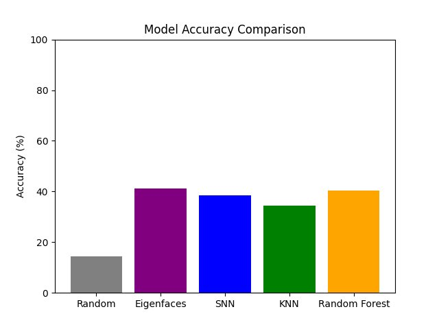
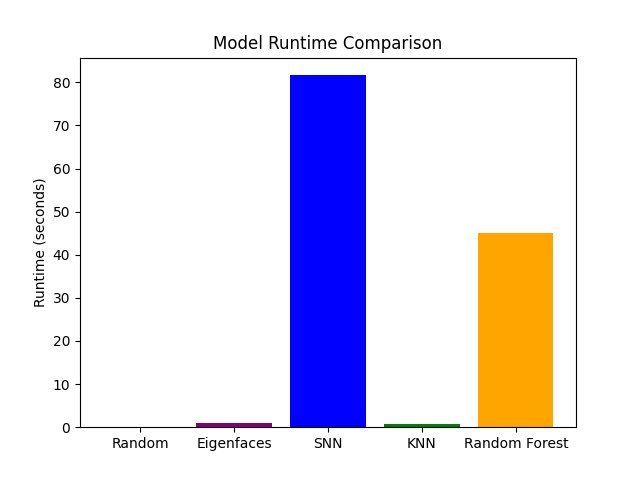
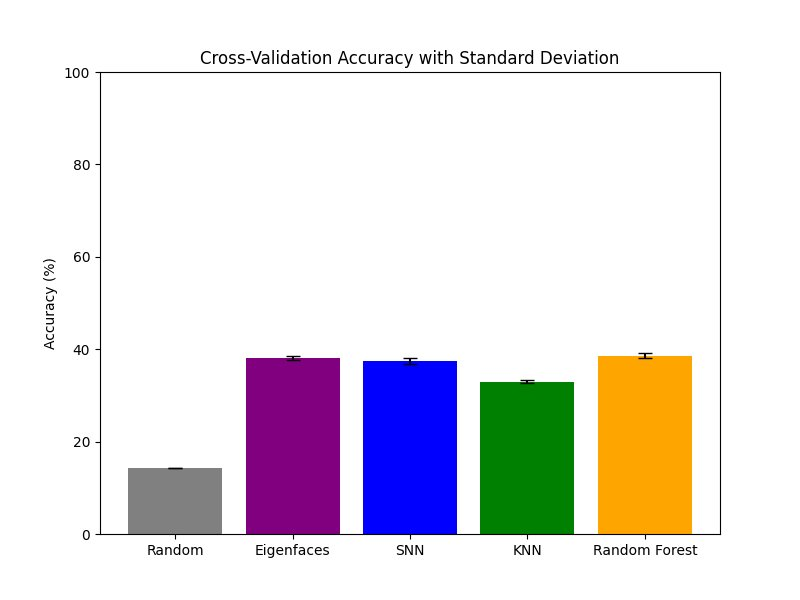
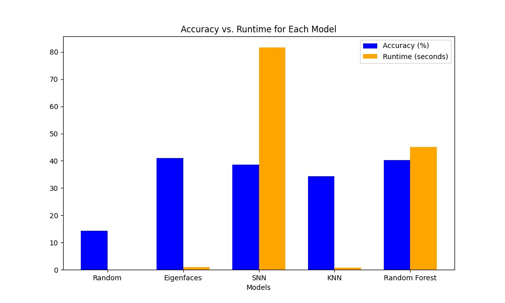
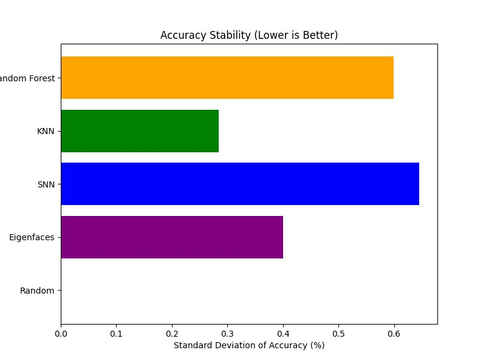
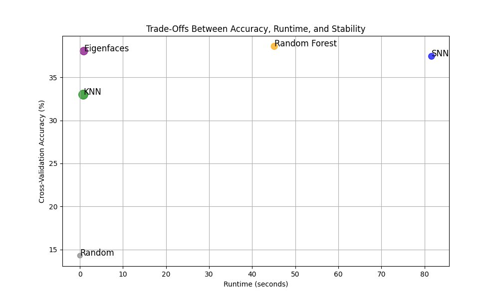
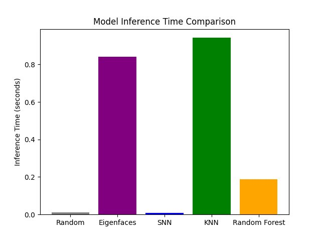
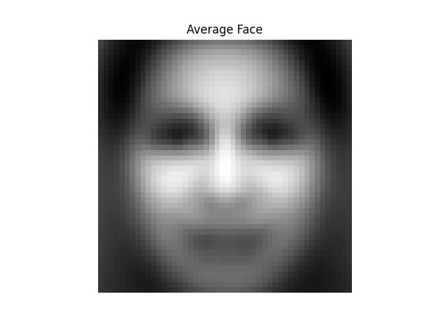

# facial-emotion-recognition

Facial emotion classification on FER2013 using PCA-based dimensionality reduction (eigenface method) and four scikit-learn classifiers.

---

## Approach

Images are preprocessed as 48×48 grayscale pixel arrays, then reduced using PCA via the eigenface method (small covariance matrix trick, retaining 95% of variance). Four classifiers are trained and benchmarked on the reduced features:

| Model | Type |
|---|---|
| Eigenfaces (1-NN) | Exact nearest-neighbor in eigenface subspace |
| Shallow Neural Network | MLP, 1 hidden layer (100 units), ReLU, Adam |
| K-Nearest Neighbors | k=3 |
| Random Forest | 100 trees |

A random baseline (1/7 ≈ 14.3%) is included for reference.

---

## Key Results

Evaluated on FER2013 test split (7 emotion classes).

| Model | Test Accuracy | CV Accuracy | Train Runtime |
|---|---|---|---|
| Random | 14.3% | 14.3% | — |
| Eigenfaces | ~41% | ~38% | <1s |
| SNN | ~39% | ~37% | ~82s |
| KNN | ~35% | ~33% | <1s |
| Random Forest | ~40% | ~39% | ~45s |

Eigenfaces and Random Forest achieve the best accuracy. SNN has the highest training cost. KNN and Eigenfaces have the fastest inference times.

### Figures

| | |
|---|---|
|  |  |
|  |  |
|  |  |
|  |  |

---

## Project Structure

```
facial-emotion-recognition/
├── run.py              ← entry point
├── src/
│   ├── __init__.py
│   ├── data.py         ← image loading and preprocessing
│   ├── pca.py          ← eigenface PCA implementation
│   ├── models.py       ← classifier training and evaluation
│   └── viz.py          ← figure generation
├── docs/
│   └── facial_emotion_recognition.pdf
└── figures/            ← output plots (committed)
```

---

## Usage

```bash
pip install numpy matplotlib pillow scikit-learn psutil
python run.py
```

Set `DATASET_PATH` at the top of `run.py` to your local FER2013 directory.

**Dataset:** FER2013 — M. Sambare, "FER-2013," Kaggle, 2021. [Download](https://www.kaggle.com/datasets/msambare/fer2013)

The dataset is not included in this repository due to size. Download and unzip it locally before running.

Key parameters (top of `run.py`):

```python
DATASET_PATH       = "path/to/fer2013"
VARIANCE_THRESHOLD = 0.95   # fraction of variance retained by PCA
N_CLASSES          = 7      # emotion classes in FER2013
```

---

## Paper

Full write-up including methodology, results, and discussion:
[`docs/facial_emotion_recognition.pdf`](https://raw.githubusercontent.com/Tristonious/facial-emotion-recognition/main/docs/facial_emotion_recognition.pdf)

---

## Note on AI Assistance

The original implementation for this project was developed as coursework (BMI 8400). The code in this repository has been refactored with the assistance of Claude (Anthropic) for clarity, structure, and readability. The underlying algorithms, methodology, and analysis are my own work.
